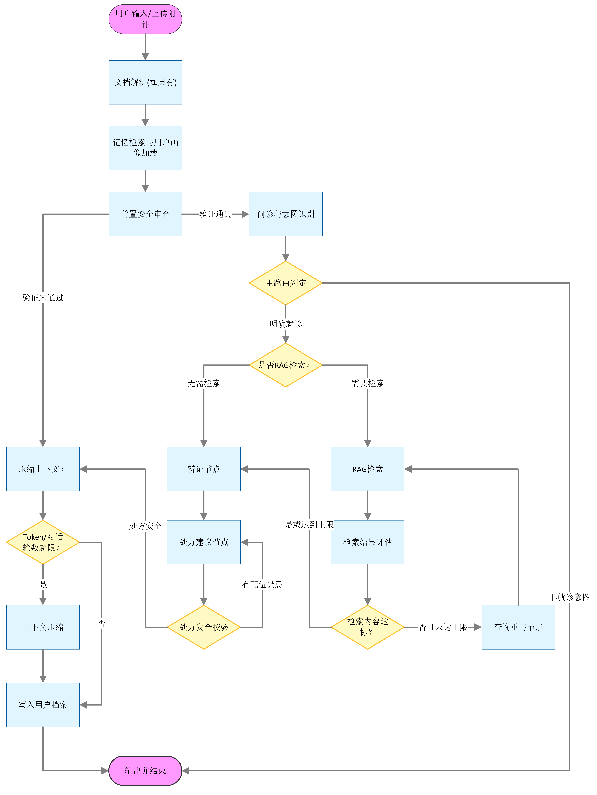
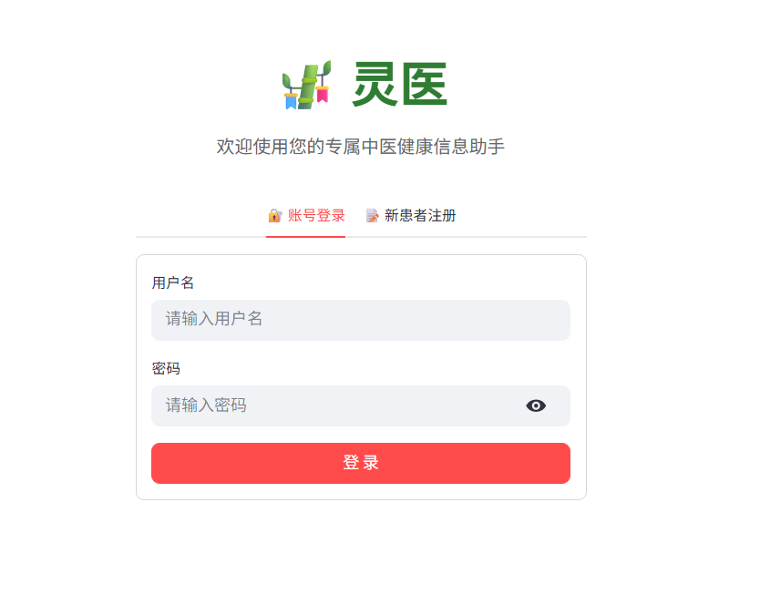
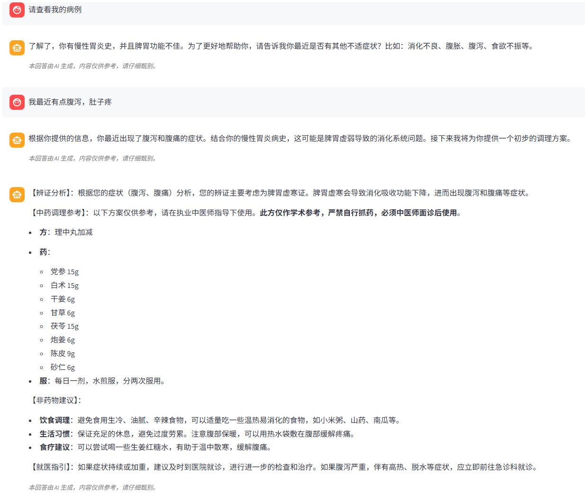
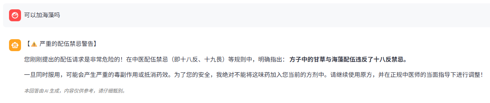
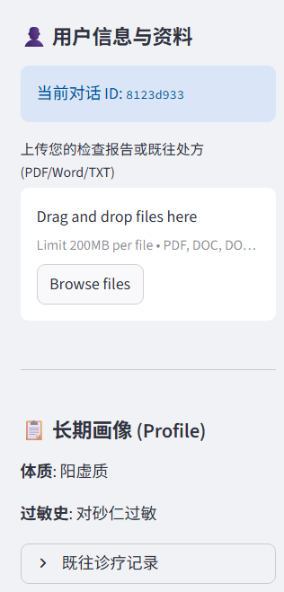

# 🎋 灵医 (LingYi) - 垂直领域中医诊疗智能体


**灵医 (LingYi)** 是一款基于 **LangGraph** 框架和 **Qwen3** 大语言模型驱动的垂直领域中医诊疗多智能体系统。本项目实现了一个基础的中医诊疗推演流程，具备多轮问诊交互能力，结合了基本的动态按需 RAG 检索、配伍安全护栏以及长短期记忆管理机制，是 Agent 在医疗垂直领域的一次实践应用。

---

## ✨ 核心特性

- 🧠 **基础工作流编排**：采用工作流执行与医学逻辑解耦的模式，包含问诊、RAG、辨证、处方、档案写入等多节点协同作业。
- 🛡️ **医疗安全校验**： 
  - **前置意图阻断**：初步识别并拦截用户主动提出的危险（“十八反、十九畏”）配伍请求。
  - **后置处方核验**：对 AI 生成的处方进行实体抽取并在代码层面做校验，发现配伍禁忌即刻强制阻断并要求模型回滚重写。
- 📚 **按需知识检索**：Agent 会根据辨证需要动态决定是否调阅本地古籍库。
- 💾 **长短期记忆管理**：
  - **上下文自适应压缩**：内置 Token 监控机制，超过限制自动生成“对话摘要”，避免长程对话超出上下文限制。
  - **患者档案持久化**：使用 SQLite 本地记录用户体质、过敏史与既往情况。
- 💻 **前端 UI**：
- 基于 Streamlit 实现，支持账户与会话的简单隔离、URL 参数同步以及历史会话管理。

---

## ⚙️ 系统架构

核心工作流受 LangGraph 的 `StateGraph` 与状态机 (`AgentState`) 支配，数据在图网络中严格流转：



---

## 系统演示






## 🚀 快速开始
### 1. 环境准备
推荐使用 Python 3.10 及以上版本。
```bash
git clone https://github.com/your-username/LingYi.git
cd LingYi
pip install -r requirements.txt
```

### 2. 环境配置
在项目根目录创建 `.env` 文件，配置必要的大模型 API Key 及相关变量：
```ini
# 例如使用阿里云千问 API / 其他 OpenAI 格式接口
QWEN_API_KEY=your_api_key_here
BASE_URL=https://dashscope.aliyuncs.com/compatible-mode/v1
```

### 3. 数据初始化与知识库构建
系统依托于 `TCM_data/` 下深度清洗的中医古籍文本（文本数据来源于[dongpeng6](https://github.com/dongpeng6/tcm-rag-system))，首次运行前需将其向量化入库（ChromaDB）：
```bash
python tools/ingest.py
```
*(注：所有 SQLite 数据库 `patient_profiles.db`, `checkpoints.db` 将会在应用首次启动时由系统自动创建完成建表。)*

### 4. 启动应用
使用 Streamlit 运行可视化完整后端与界面：
```bash
streamlit run app.py
```
应用将在默认的 `http://localhost:8501` 启动。

---

## 📁 目录结构

```text
LingYi/
├── agent/
│   ├── memory/             # 长期记忆追踪、上下文 Token 压缩逻辑
│   ├── skills/             # 核心技能模块
│   ├── graph.py            # LangGraph 图编排与路由算法
│   ├── state.py            # Graph 状态机与变量字典定义
│   └── prompts.py          # 全局静态 Prompt 模板
├── TCM_data/               # 中医古籍数据（伤寒杂病论、神农本草经等）
├── tools/                  # 工具（文档解析器、十八反禁忌规则、ChromaDB 客户端）
├── storage/                # ChromaDB 向量库与 SQLite(账户、画像、会话) 存储区
├── config.py               # 全局应用配置
└── app.py                  # Streamlit Web UI 主程序
```

---

## ⚠️ 免责声明
**本项目极其生成的诊疗内容仅供技术探索、学术研究与 AI 学习参考，不具备任何临床执业资格及医学与法律效力。** 
有任何身体不适请务必前往正规医疗机构寻求专业执业医师的当面诊疗。开发者不对依赖本项目输出造成的任何健康风险或后果承担任何责任。

---

## 📄 开源许可证
本项目遵循 [MIT License](LICENSE) 开源协议
