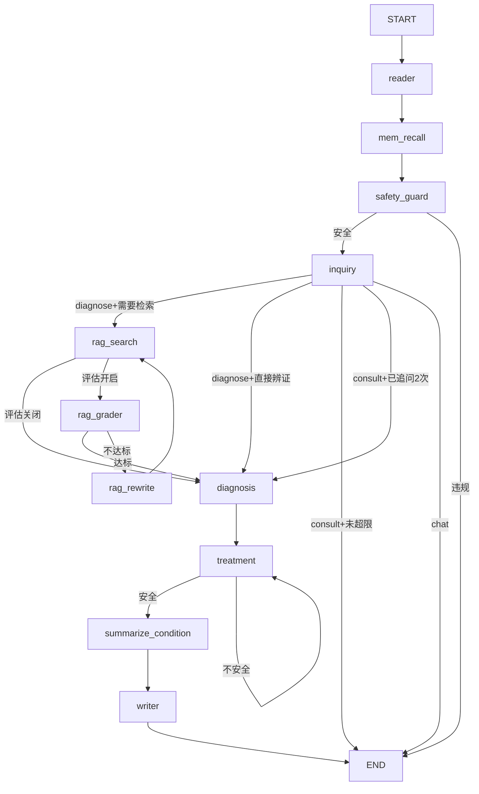

# 架构说明

## 整体架构

灵医采用 **FastAPI 后端 + Streamlit 前端** 的分层架构：

```
┌─────────────────────────────────────────────────────┐
│                   Streamlit UI (thin client)         │
│   lingyi/ui/auth.py · chat.py · sidebar.py          │
└──────────────────────┬──────────────────────────────┘
                       │ HTTP / WebSocket
┌──────────────────────▼──────────────────────────────┐
│                   FastAPI Backend                    │
│   lingyi/api/routes/chat.py · health.py · threads.py│
│   lingyi/api/deps.py (依赖注入) · schemas.py        │
└──────────────────────┬──────────────────────────────┘
                       │
┌──────────────────────▼──────────────────────────────┐
│              Core Business Logic (纯 Python)         │
│   lingyi/agent/ · rag/ · safety/ · storage/         │
│   ← 不依赖 FastAPI 或 Streamlit，可独立测试          │
└─────────────────────────────────────────────────────┘
```

## 设计原则

- **全链路异步** — API → Agent → LLM → Storage 全部 `async/await`
- **依赖注入** — 所有外部依赖通过构造函数注入
- **接口抽象** — RAG、Embedding、Storage 都有抽象基类 + 多实现
- **Core 层零框架依赖** — agent/rag 不 import FastAPI 或 Streamlit

## 模块职责

| 模块 | 职责 | 关键文件 |
|---|---|---|
| `lingyi/config.py` | 全局配置 | `Settings`, `get_settings()` |
| `lingyi/models/` | LLM/Embedding 抽象 | `BaseLLM`, factory |
| `lingyi/agent/` | LangGraph 图 + 技能 | `graph.py`, `skills/` |
| `lingyi/rag/` | RAG 检索 | `BaseRAGClient`, mock/chroma |
| `lingyi/safety/` | 配伍禁忌引擎 | `SafetyEngine` |
| `lingyi/storage/` | 持久化 | `SQLiteStorage` |
| `lingyi/api/` | FastAPI 后端 | `app.py`, routes |
| `lingyi/ui/` | Streamlit 前端 | `app.py` |
| `data_pipeline/` | 数据处理 | chunkers, ingest |

## Agent 工作流



### 关键设计

- **问诊循环控制**: `intent="consult"` 时暂停图执行，返回追问给用户。`inquiry_count` 限制最多追问 2 次，之后强制进入诊断
- **意图重置**: 每次新消息时重置 `intent_type="chat"`，防止 checkpointer 中的旧状态影响路由
- **回复提取**: 从消息列表中取最后一条 `type=ai` 的消息，而非 `messages[-1]`
- **画像提取**: `ProfileWriterSkill`（原 WriterSkill）用 `await asyncio.wait_for` 在有限超时内完成写入，不 fire-and-forget；`MemRecallSkill` 在图开始时加载画像
