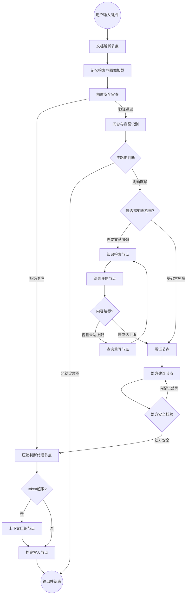

# 🎋 灵医 (LingYi) - 垂直领域中医智能体 (Specialized TCM Agent) 全案

## 1. 项目简介 (Project Overview)

“灵医” 是一款基于 **LangGraph** 框架和 **Qwen3** 系列模型构建的深度中医诊疗智能体。它不仅能进行多轮“望闻问切”交互，更具备长短期记忆管理、上下文自动压缩、以及**按需激活、自我优化的 RAG 知识检索系统**。

### 1.1 核心价值

- **解耦架构**：采用“Python (流程) + Markdown (医学逻辑)”的解耦模式。
- **按需增强 (On-Demand RAG)**：根据对话意图动态决定是否检索，避免无效计算。
- **证据导向 (Evidence-Based)**：在复杂或罕见病症下，通过 RAG 环路确保辨证有据可依。
- **长程管理**：通过长期记忆系统记录患者画像，实现复诊连续性与个性化。

## 2. 逻辑架构设计 (System Architecture)

### 2.1 核心工作流 (LangGraph Workflow)



### 2.2 技能驱动模式 (Skill-Driven Intelligence)

当前版本沿用 **Skill Specification** 规范，每个核心节点关联对应的 `.md` 文档：

1. **执行逻辑 (.py)**：处理 State 转换、按需 RAG 决策、知识检索与校验。
2. **专业规格 (.md)**：存储该技能的 **Prompt、Few-shot、评估准则**。

## 3. 核心子系统设计

### 3.1 增强型 RAG 检索引擎 (RAG Engine Skill)

- **按需检索逻辑**：`Inquiry` 节点提取症状后，由路由节点判定是否需要检索。对于常规的“风寒感冒”等简单证候，可选择直接辨证。
- **多步检索 (Multi-hop)**：支持针对复杂病症拆解为多个子查询。
- **自我评估 (Self-Grader)**：利用 LLM 判定检索到的文献片段是否能解释当前的“症状/舌脉”。
- **重写机制 (Rewrite)**：若评分低于 0.7，自动将口语化症状转化为专业中医词汇进行二次检索。

### 3.2 深度记忆 system (Memory System)

- **短期记忆**：记录当前 Session 内的 RAG 检索轨迹。
- **长期画像**：记录患者既往有效方剂，在 `Treatment` 阶段作为权重引入。
- **上下文压缩**：当对话历史超过 8000 Tokens 时，触发摘要节点。

### 3.3 技能中心 (Skills & Tools)

- **Inquiry Skill**：核心任务是问诊与意图识别。精准区分“闲聊”、“普通咨询”与“求医就诊”。
- **Diagnosis Skill**：结合 RAG 证据或模型内化知识，执行“理、法、方、术、调”推演。
- **Safety Skill**：保障医患对话与处方推荐安全，包括物理代码校验“十八反十九畏”以及前置的话题合规性审查。
- **Reader & Writer**：分别负责从用户病历提取初始病史，以及将会话产生的画像增量写入持久化数据库提取模块。

## 4. 项目结构说明 (Directory Structure)

```
LingYi/
├── agent/
│   ├── memory/           
│   │   ├── checkpointer.py    
│   │   └── summarizer.py      
│   ├── skills/           # 技能 = Py (逻辑) + Md (提示词)
│   │   ├── inquiry.py / .md   # 重点：负责分流社交辞令与医疗意图
│   │   ├── rag_search.py / .md 
│   │   ├── diagnosis.py / .md 
│   │   ├── treatment.py / .md 
│   │   ├── reader.py          
│   │   └── writer.py          
│   ├── graph.py               # 核心连线（包含 RAG 决策逻辑）
│   └── state.py               # 增加 intent_type 字段
├── tools/                
│   ├── safety_rules.py        
│   └── vector_db_client.py    
├── storage/              
└── app.py                
```

## 5. 关键实施标准

### 5.1 RAG 激活与终止条件

- **激活条件**：用户意图为“诊疗”且模型判定当前症状组合需要经典文献（如伤寒论条文）支撑时。
- **跳过条件**：用户进行简单的“你好”招呼、询问系统身份、或者模型对当前症状有 95% 以上把握直接辨证。
- **强制终止**：`rag_retry_count >= 3`，防止死循环。

### 5.2 安全环路审查 (双重护栏机制)

为了绝对保障医疗安全，灵医采用了“前置拦截+后置核验”的双重护栏机制：

1. **前置安全审查 (Safety Guard)**：在问诊和辨证前，专门审查用户的输入意图。如果用户主动要求将存在“十八反、十九畏”等配伍禁忌的药材加入处方，系统会触发“拒绝响应”，直接输出严厉的违规警告与科普（跳过后续生成），拒绝执行危险指令。
2. **后置处方核验 (Treatment Safety Check)**：在 AI 生成处方方案后，提取其中的具体药材，利用 `tools/safety_rules.py` 进行物理规则匹配。若模型自身生成的药方存在冲突，则将 `safety_errors` 反馈给模型，强制其进行自我修正和回滚。

### 5.3 上下文压缩标准

- **保留窗口**：最近 10 轮。
- **摘要策略**：当对话历史超过 8000 Tokens的95% 时，仅压缩对话内容，保留解析出的“病历背景”和“已确认症状”。

## 6. 输出规范 (The Output Protocol)

所有产生的方案必须具备证据链（无论是否使用 RAG）：

- **【理】**：结合 RAG 文献或经典理论分析病机。
- **【法】**：确立治则。
- **【方】**：药名、剂量、煎服法。
- **【术】**：针灸与推拿建议。
- **【调】**：生活医嘱。